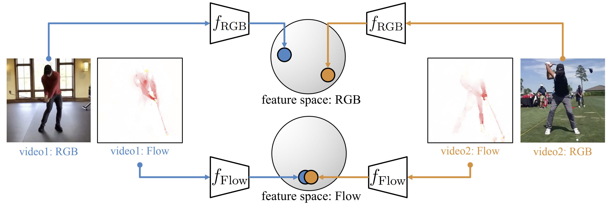
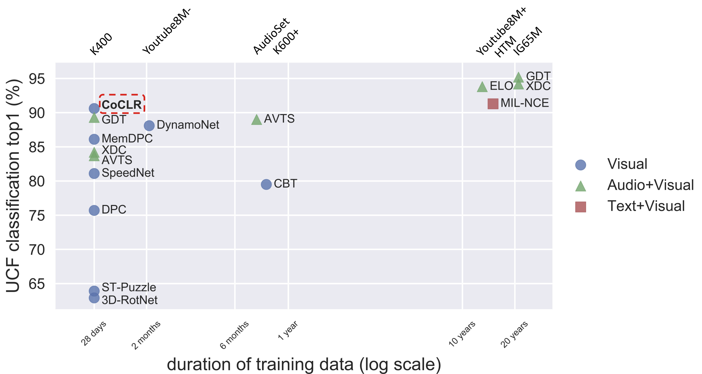

# CoCLR: Self-supervised Co-Training for Video Representation Learning



This repository contains the implementation of:

* InfoNCE (MoCo on videos)
* UberNCE (supervised contrastive learning on videos)
* CoCLR

### Link: 

[[Project Page]](http://www.robots.ox.ac.uk/~vgg/research/CoCLR/)
[[PDF]](http://www.robots.ox.ac.uk/~vgg/publications/2020/Han20b/han20b.pdf)
[[Arxiv]](https://arxiv.org/abs/2010.09709)

### News
* [2021.01.29] Upload both RGB and optical flow dataset for UCF101 [(links)](#dataset). 
* [2021.01.11] Update our paper for NeurIPS2020 final version: corrected InfoNCE-RGB-linearProbe baseline result in Table1 from 52.3% (pretrained for 800 epochs, unnessary and unfair) to 46.8% (pretrained for 500 epochs, fair comparison). Thanks [@liuhualin333](https://github.com/liuhualin333) for pointing out.
* [2020.12.08] Update instructions.
* [2020.11.17] Upload pretrained weights for UCF101 experiments.
* [2020.10.30] Update "draft" dataloader files, CoCLR code, evaluation code as requested by some researchers. Will check and add detailed instructions later.

### Pretrain Instruction

* InfoNCE pretrain on UCF101-RGB
```
CUDA_VISIBLE_DEVICES=0,1 python -m torch.distributed.launch \
--nproc_per_node=2 main_nce.py --net s3d --model infonce --moco-k 2048 \
--dataset ucf101-2clip --seq_len 32 --ds 1 --batch_size 32 \
--epochs 300 --schedule 250 280 -j 16
```

* InfoNCE pretrain on UCF101-Flow
```
CUDA_VISIBLE_DEVICES=0,1 python -m torch.distributed.launch \
--nproc_per_node=2 main_nce.py --net s3d --model infonce --moco-k 2048 \
--dataset ucf101-f-2clip --seq_len 32 --ds 1 --batch_size 32 \
--epochs 300 --schedule 250 280 -j 16
```

* CoCLR pretrain on UCF101 for one cycle
```
CUDA_VISIBLE_DEVICES=0,1 python -m torch.distributed.launch \
--nproc_per_node=2 main_coclr.py --net s3d --topk 5 --moco-k 2048 \
--dataset ucf101-2stream-2clip --seq_len 32 --ds 1 --batch_size 32 \
--epochs 100 --schedule 80 --name_prefix Cycle1-FlowMining_ -j 8 \
--pretrain {rgb_infoNCE_checkpoint.pth.tar} {flow_infoNCE_checkpoint.pth.tar}
```
```
CUDA_VISIBLE_DEVICES=0,1 python -m torch.distributed.launch \
--nproc_per_node=2 main_coclr.py --net s3d --topk 5 --moco-k 2048 --reverse \
--dataset ucf101-2stream-2clip --seq_len 32 --ds 1 --batch_size 32 \
--epochs 100 --schedule 80 --name_prefix Cycle1-RGBMining_ -j 8 \
--pretrain {flow_infoNCE_checkpoint.pth.tar} {rgb_cycle1_checkpoint.pth.tar} 
```

* InfoNCE pretrain on K400-RGB
```
CUDA_VISIBLE_DEVICES=0,1,2,3 python -m torch.distributed.launch \
--nproc_per_node=4 main_infonce.py --net s3d --model infonce --moco-k 16384 \
--dataset k400-2clip --lr 1e-3 --seq_len 32 --ds 1 --batch_size 32 \
--epochs 300 --schedule 250 280 -j 16
```

* InfoNCE pretrain on K400-Flow
```
CUDA_VISIBLE_DEVICES=0,1,2,3 python -m torch.distributed.launch \
--nproc_per_node=4 teco_fb_main.py --net s3d --model infonce --moco-k 16384 \
--dataset k400-f-2clip --lr 1e-3 --seq_len 32 --ds 1 --batch_size 32 \
--epochs 300 --schedule 250 280 -j 16
```

* CoCLR pretrain on K400 for one cycle
```
CUDA_VISIBLE_DEVICES=0,1 python -m torch.distributed.launch \
--nproc_per_node=2 main_coclr.py --net s3d --topk 5 --moco-k 16384 \
--dataset k400-2stream-2clip --seq_len 32 --ds 1 --batch_size 32 \
--epochs 50 --schedule 40 --name_prefix Cycle1-FlowMining_ -j 8 \
--pretrain {rgb_infoNCE_checkpoint.pth.tar} {flow_infoNCE_checkpoint.pth.tar}
```
```
CUDA_VISIBLE_DEVICES=0,1 python -m torch.distributed.launch \
--nproc_per_node=2 main_coclr.py --net s3d --topk 5 --moco-k 16384 --reverse \
--dataset k400-2stream-2clip --seq_len 32 --ds 1 --batch_size 32 \
--epochs 50 --schedule 40 --name_prefix Cycle1-RGBMining_ -j 8 \
--pretrain {flow_infoNCE_checkpoint.pth.tar} {rgb_cycle1_checkpoint.pth.tar} 
```

### Finetune Instruction
`cd eval/`
e.g. finetune UCF101-rgb:
```
CUDA_VISIBLE_DEVICES=0,1 python main_classifier.py --net s3d --dataset ucf101 \
--seq_len 32 --ds 1 --batch_size 32 --train_what ft --epochs 500 --schedule 400 450 \
--pretrain {selected_rgb_pretrained_checkpoint.pth.tar}
```
then run the test with 10-crop (test-time augmentation is helpful, 10-crop gives better result than center-crop):
```
CUDA_VISIBLE_DEVICES=0,1 python main_classifier.py --net s3d --dataset ucf101 \
--seq_len 32 --ds 1 --batch_size 32 --train_what ft --epochs 500 --schedule 400 450 \
--test {selected_rgb_finetuned_checkpoint.pth.tar} --ten_crop
```

### Nearest-neighbour Retrieval Instruction
`cd eval/`
e.g. nn-retrieval for UCF101-rgb
```
CUDA_VISIBLE_DEVICES=0 python main_classifier.py --net s3d --dataset ucf101 \
--seq_len 32 --ds 1 --test {selected_rgb_pretrained_checkpoint.pth.tar} --retrieval
```

### Linear-probe Instruction
`cd eval/`
#### from extracted feature
The code support two methods on linear-probe, 
either feed the data end-to-end and freeze the backbone, 
or train linear layer on extracted features.
Both methods give similar best results in our experiments.

e.g. on extracted features (after run NN-retrieval command above, features will be saved in `os.path.dirname(checkpoint)`)
```
CUDA_VISIBLE_DEVICES=0 python feature_linear_probe.py --dataset ucf101 \
--test {feature_dirname} --final_bn --lr 1.0 --wd 1e-3
```
Note that the default setting should give an alright performance, maybe 1-2% lower than our paper's figure. 
For different datasets, `lr` and `wd` need to be tuned from lr: 0.1 to 1.0; wd: 1e-4 to 1e-1.

#### load data and freeze backbone
alternatively, feed data end-to-end and freeze the backbone.
```
CUDA_VISIBLE_DEVICES=0,1 python main_classifier.py --net s3d --dataset ucf101 \
--seq_len 32 --ds 1 --batch_size 32 --train_what last --epochs 100 --schedule 60 80 \
--optim sgd --lr 1e-1 --wd 1e-3 --final_bn --pretrain {selected_rgb_pretrained_checkpoint.pth.tar}
```
Similarly, `lr` and `wd` need to be tuned for different datasets for best performance.  


### Dataset
* RGB for UCF101: [[download-from-server]](http://thor.robots.ox.ac.uk/~vgg/data/CoCLR/ucf101_rgb_lmdb.tar) [[download-from-gdrive]](https://drive.google.com/file/d/1jVqBWl6iHYzcnb0IZ5ezpH_uK5jdHtoF/view?usp=sharing) (tar file, 29GB, packed with lmdb)
* TVL1 optical flow for UCF101: [[download-from-server]](http://thor.robots.ox.ac.uk/~vgg/data/CoCLR/ucf101_flow_lmdb.tar) [[download-from-gdrive]](https://drive.google.com/file/d/1NRElvRyVKX8siVu5HFKOETn4uqnzM4GH/view?usp=sharing) (tar file, 20.5GB, packed with lmdb)
* Note: I created these lmdb files with msgpack==0.6.2, when load them with msgpack>=1.0.0, you can do `msgpack.loads(raw_data, raw=True)`([issue#32](https://github.com/TengdaHan/CoCLR/issues/32))

### Result
Finetune entire network for action classification on UCF101:


### Pretrained Weights

Our models:
* UCF101-RGB-CoCLR: [[download]](http://www.robots.ox.ac.uk/~htd/coclr/CoCLR-ucf101-rgb-128-s3d-ep182.tar) [NN@1=51.8 on UCF101-RGB]
* UCF101-Flow-CoCLR: [[download]](http://www.robots.ox.ac.uk/~htd/coclr/CoCLR-ucf101-flow-128-s3d-epoch109.pth.tar) [NN@1=48.4 on UCF101-Flow]

Baseline models:
* UCF101-RGB-InfoNCE: [[download]](http://www.robots.ox.ac.uk/~htd/coclr/InfoNCE-ucf101-rgb-128-s3d-ep399.pth.tar) [NN@1=33.1 on UCF101-RGB]
* UCF101-Flow-InfoNCE: [[download]](http://www.robots.ox.ac.uk/~htd/coclr/InfoNCE-ucf101-f-128-s3d-ep396.pth.tar) [NN@1=45.2 on UCF101-Flow]

Kinetics400-pretrained models：
* K400-RGB-CoCLR: [[download]](http://www.robots.ox.ac.uk/~htd/coclr/CoCLR-k400-rgb-128-s3d.pth.tar) [NN@1=45.6, Finetune-Acc@1=87.89 on UCF101-RGB]
* K400-Flow-CoCLR: [[download]](http://www.robots.ox.ac.uk/~htd/coclr/CoCLR-k400-flow-128-s3d.pth.tar) [NN@1=44.4, Finetune-Acc@1=85.27 on UCF101-Flow]
* Two-stream result by average the class probability: 0.8789 + 0.8527 => 0.9061


